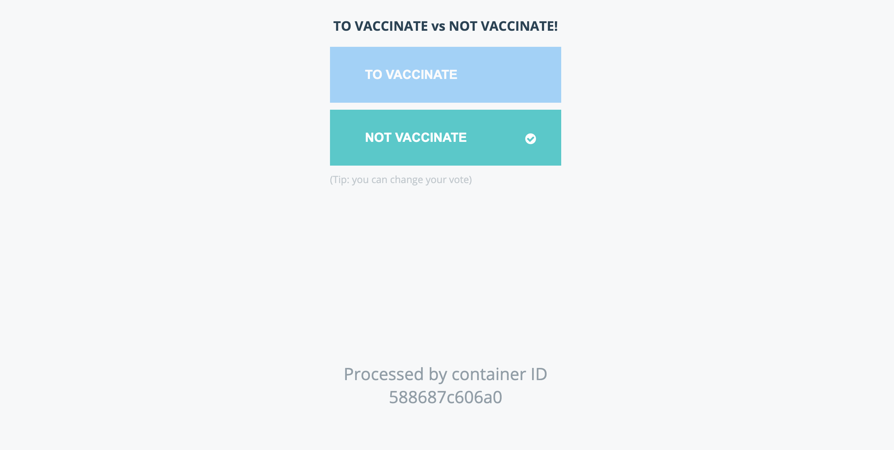

# vaccinevoting-app

##### Docker run
```
docker run -d --name=redis redis
docker run -d --name=db
docker run -d --name=vote-vacc -p 5000:80  vaccinevoting-app
docker run -d --name=result -p 5001:80 result-app
docker run -d --name=worker worker
```
##### Docker links: used to link two containers
```
docker --link
```
#### Example
```
docker run -d --name=vote-vacc -p 5000:80  --link redis:redis vaccinevoting-app
docker run -d --name=result -p 5001:80  --link db:db result-app
docker run -d --name=worker -p 5001:80  --link db:db --link redis:redis worker

```
##### Generating the docker-compose.yml file.
```
redis:
  image: redis
posgres-db:
  image:postgres:9.4
vote-vacc:
  image:vaccinevoting-app
     ports:
        - 5000:80
     links:
        - redis
result:
  image: result-app
    ports:
      - 5001:80
    links:
      - db
worker:
  image: worker
    links:
      - redis
      - db

```
##### In case an app has to be built, image is replaced by the directory of that app.
```
redis:
  image: redis
posgres-db:
  image:postgres:9.4
vote-vacc:
  build:./vaccinevoting-app
     ports:
        - 5000:80
     links:
        - redis
result:
  build: ./result-app
    ports:
      - 5001:80
    links:
      - db
worker:
  build: ./worker
    links:
      - redis
      - db

```



#### Docker compose
